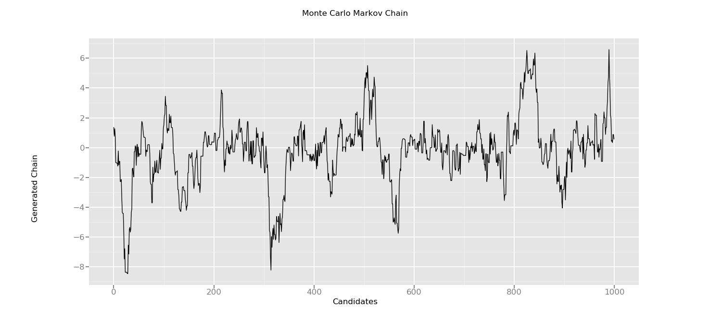

title: Metropolis-Hastings Sampler
date: 2019-03-06
abstract: An implementation of the Metropolis-Hastings Sampler in Python.
topic: Computational Statistics
color: "F0433A"
unlisted: 0

Monte-Carlo-Markov-Chain (MCMC) methods are a great way to generate a random sample from a complex distribution using 
a well-defined prior distribution. Specifically, the Metropolis-Hastings sampler is one of many samplers that can be used
to generate a random sample when the underlying density is not well-defined. 

Moving on, the sampler has the following form

$$ \alpha(X_t,Y) = \frac{\pi(Y)q(X_t|Y)}{\pi(X_t)q(Y|X_t)}$$ 
 
Where $\pi(.)$ is the targeted distribution and $q(.|.)$ is the prior distribution. Note, we might not always have $\pi(.)$, so, 
we may need to use a kernel density estimate. 

Please be aware that the procedure of constructing the Metropolis-Hastings sampler is similar to the rejection-acceptance sampling procedure.  

Okay, now that we have the germ of the sampler detailed, we can move move onto an example.
  
```python
from ggplot import *
import numpy as np
import numpy.random as random
import matplotlib.pyplot as plt
import pandas as pd

#we are interested in generating a random sample from a cauchy distribution
def target(x):
    return 1/(1+x**2)

#we will use a normal distribution to generate a candidate point since it shares 
#a similar domain as the target distribution
def proposal(x,mu,sigma):
    return np.exp(-(1/(2*sigma))*(x-mu)**2)/(((2*np.pi*sigma)**(1/2)))  

#initialize x_0, this is the chain we are generating 
chain = random.normal(0,1,1)

#number of samples to generate
n = 1000

#metripolis-hastings sampler 
def mh_sampler(sigma):
    for i in range(1,n):
        global chain
        y = chain[i-1] + random.normal(0,1,1)
        u = random.uniform(0,1,1)
		
        K = target(y)*proposal(chain[i-1],y,sigma)/(target(chain[i-1])*proposal(y,chain[i-1],sigma))
        alpha = min([1,K])
    
        if u <= alpha:
            chain = np.append(chain,y);
        else:
            chain = np.append(chain,chain[i-1])

#generate a chain where proposal distribution has a variance of 4 
mh_sampler(4)

print(chain)

#create dataframe so we can use ggplot
data = { 'x' : list(range(0,n)), 'y' : chain}
df = pd.DataFrame(data)

#plot mcmc chain
g = ggplot(aes(x='x',y='y'),data=df) + \
        geom_line() + \
        ggtitle('Monte Carlo Markov Chain') + \
        xlab("Candidates") + \
        ylab("Generated Chain")
print(g)
```

<div id=embed>

</div>

